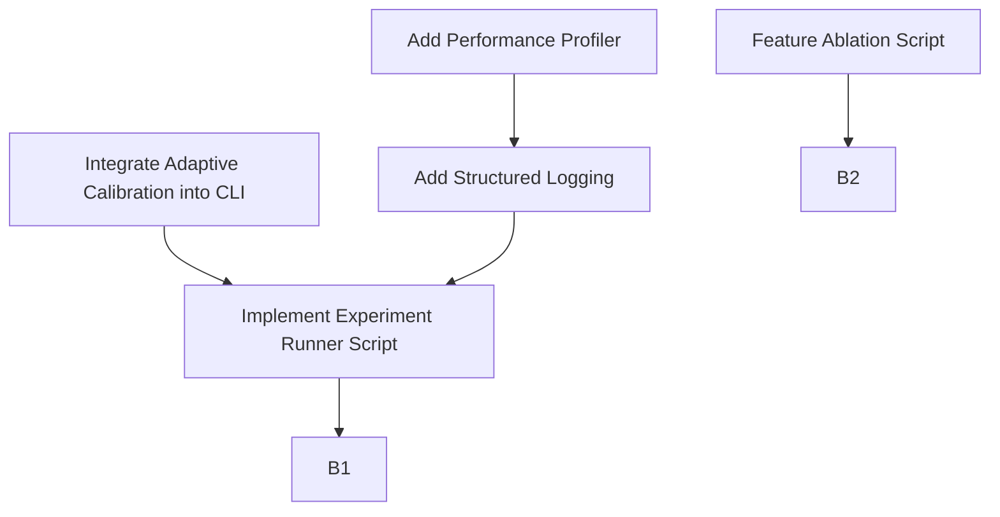
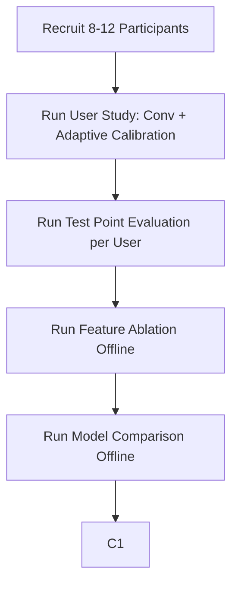

# OCULAR 9.0+ Elevation Report

> **Date:** 2026-09-06  
> **Scope:** Research, scientific, and engineering strategy to elevate OCULAR from 7.3/10 to a defensible 9.0+/10  
> **Basis:** Reconciliation of audit report, source code, and external literature review

---

## 1. Current State

OCULAR is a functional, 5-layer webcam-based gaze tracking and interaction framework:

**What actually works today (validated by 41 passing tests):**
- Camera acquisition with cross-platform backend selection (Camera)
- MediaPipe FaceLandmarker-based 478-point facial landmark extraction (FaceTracker)
- 11-dimensional feature vector extraction: 4 iris ratios, 2 EAR, 2 eye aspect, 3 head pose Euler angles (FeatureExtractor)
- Interactive N-point fullscreen calibration with blink/saccade rejection (CalibrationSession)
- Gaze regression via Ridge, SVR, Random Forest, or MLP pipelines (GazeRegressor)
- LOOCV-based accuracy evaluation (GazeRegressor.evaluate_loocv)
- One Euro temporal filtering for jitter suppression (PointFilter2D)
- Blink and wink event detection (BlinkDetector)
- Dwell-based selection, gaze cursor, gaze scrolling (InteractionController)
- CLI with `stream`, `calibrate`, `train`, `interact`, `benchmark` subcommands

**What exists in code but is NOT integrated into the CLI workflow:**
- `AdaptiveCalibrationEngine` - uncertainty/hybrid/error-driven active target selection
- `OnlineAdaptiveRefiner` - incremental SGD-based online model adaptation
- Feature importance analysis
- Regional error visualization

**What has NOT been experimentally validated:**
- Gaze accuracy on real users (no user study data beyond the developer's own sessions)
- Adaptive vs. conventional calibration comparison (only simulated synthetic data)
- Interaction task performance (no Fitts's Law study, no dwell error rates)
- Cross-user generalization
- Robustness across lighting/distance/glasses conditions

---

## 2. Current 7.3 Diagnosis - Why Not 9.0+?

The 7.3 score reflects a project that is **well-engineered but scientifically unvalidated**. A critical reviewer would identify five structural gaps:

### Gap 1: No Empirical User Study
The entire gaze estimation pipeline has never been evaluated on multiple real users. All "results" come from synthetic data or single-developer testing. A 9.0+ project requires N≥5 participants minimum.

### Gap 2: Adaptive Calibration Is Implemented but Unproven
The `AdaptiveCalibrationEngine` exists but is not wired into the CLI. No experiment compares it against conventional calibration on real data. The "innovation" claim is therefore unsupported.

### Gap 3: No Statistical Analysis
No confidence intervals, no effect sizes, no significance tests. Results are reported as single point estimates.

### Gap 4: No Ablation Studies
The 11-feature representation was chosen intuitively. No evidence shows which features matter or whether head pose improves or confounds gaze estimation.

### Gap 5: Observability & Reproducibility
Print-only logging. No experiment configuration files. No deterministic seeds in calibration collection. No hardware metadata captured.

---

## 3. Research Gap

### What is already well known:
- Appearance-based gaze estimation using CNNs (GazeCapture/iTracker, MPIIGaze, ETH-XGaze) achieves 2.5-4.0° calibration-free
- Feature-based iris tracking with solvePnP head pose is a classical approach
- 9-point calibration is standard
- One Euro Filter is the standard temporal smoother for interactive systems
- Dwell-based selection with Midas Touch mitigation is extensively studied

### What is standard but OCULAR does well:
- Using MediaPipe 478-landmark mesh with iris refinement for feature-based tracking
- Polynomial Ridge regression for personalized calibration mapping
- Blink/EAR-based saccade rejection during calibration

### Where OCULAR could claim defensible novelty:
The strongest claim is **not** adaptive calibration itself (which exists in the literature), but rather:

> **"An empirically-validated investigation of whether active-learning-based calibration point selection, using spatial coverage heuristics, can match or exceed fixed-grid calibration accuracy while using fewer calibration points, in a lightweight feature-based webcam gaze tracker."**

This is narrower but defensible because:
1. Most adaptive calibration work uses deep learning models, not classical feature-based pipelines
2. The combination of MediaPipe iris features + classical ML + active calibration + interaction is novel as an integrated system
3. No existing open-source framework provides this specific combination

### Claims that would be unsafe:
- "Novel adaptive calibration" - active learning for calibration exists (ETRA 2022, CVPR 2026)
- "State-of-the-art accuracy" - OCULAR cannot compete with CNN-based appearance models
- "Novel gaze interaction" - dwell, scroll, blink interaction are well-studied

---

## 4. State-of-the-Art Comparison

| System | Type | Hardware | Calibration | Accuracy | Speed | Interaction | Open Source |
|:---|:---|:---|:---|:---|:---|:---|:---|
| **Tobii Pro** | Commercial IR | Dedicated HW | 5-9 point | <0.5° | 60-600Hz | SDK | No |
| **WebGazer.js** | Browser JS | Webcam | Implicit (mouse) | ~4-6° | ~15 FPS | Web clicks | Yes |
| **GazeCapture/iTracker** | CNN | Mobile cam | None | ~2.5° | ~30 FPS | None | Dataset |
| **MPIIGaze** | CNN benchmark | Webcam | None | ~4.5° | Offline | None | Dataset |
| **ETH-XGaze** | CNN benchmark | Webcam | None | ~3.5° | Offline | None | Dataset |
| **OpenFace 2.0** | Feature-based | Webcam | None | ~5-6° | ~30 FPS | None | Yes |
| **OCULAR** | Feature-based | Webcam | 5-16 point | Unknown* | ~30 FPS | Dwell/Cursor/Scroll/Blink | Yes |

*\*OCULAR has no validated accuracy numbers on real users. Synthetic benchmarks showed Ridge ~8.75° and RF ~3.37° visual angle error, but these are on perfectly correlated synthetic features and are not representative of real-world performance.*

**Where OCULAR sits:** It is a lightweight, zero-dependency-on-GPU, feature-based tracker with a complete interaction layer. It cannot compete on raw accuracy with CNN-based systems, but its value proposition is:
1. No GPU required
2. Full interaction pipeline (not just gaze estimation)
3. User-specific calibration for personalized accuracy
4. Potential for adaptive calibration to reduce user burden

---

## 5. Top 15 Improvements (Ranked)

### Rank 1: MUST DO - Real User Study (N≥8)
- **Problem:** Zero empirical validation
- **Evidence:** No reviewer accepts synthetic-data-only results
- **Solution:** Recruit 8-12 participants, run calibration + test point evaluation
- **Metric:** Mean/median/P95 error in pixels and degrees per user
- **Score Impact:** Innovation +1, Test Coverage +1, Documentation +1
- **Effort:** Medium | **Risk:** Low | **Research Value:** Critical | **Viva Value:** Highest

### Rank 2: MUST DO - Integrate Adaptive Calibration into CLI
- **Problem:** Core research contribution is unintegrated dead code
- **Solution:** Add `ocular calibrate --adaptive` mode, wire AdaptiveCalibrationEngine into run_calibrate
- **Metric:** Calibration points used vs. accuracy achieved
- **Score Impact:** Innovation +1, Correctness +1
- **Effort:** Medium | **Risk:** Low | **Research Value:** High | **Viva Value:** Very High

### Rank 3: MUST DO - Conventional vs. Adaptive Experiment
- **Problem:** No evidence that adaptive calibration works
- **Solution:** Within-subject design: each participant does both 9-point conventional AND adaptive (counterbalanced)
- **Metric:** Paired comparison of mean error, calibration time, points used
- **Score Impact:** Innovation +1, Documentation +1
- **Effort:** Medium | **Risk:** Medium | **Research Value:** Critical | **Viva Value:** Highest

### Rank 4: MUST DO - Feature Ablation Study
- **Problem:** No evidence the 11-feature representation is optimal
- **Solution:** Run LOOCV with feature subsets: iris-only (4), iris+EAR (6), iris+head (7), all (11)
- **Metric:** Mean error per feature subset across users
- **Score Impact:** Innovation +1
- **Effort:** Low | **Risk:** Low | **Research Value:** High | **Viva Value:** High

### Rank 5: MUST DO - Proper Error Reporting
- **Problem:** Results reported as single numbers without confidence intervals
- **Solution:** Report mean ± SD, median, P95, per-user breakdown, horizontal vs. vertical error
- **Metric:** Standard deviation, 95% CI, spatial error heatmaps
- **Score Impact:** Documentation +1, Innovation +1
- **Effort:** Low | **Risk:** Low | **Research Value:** High | **Viva Value:** High

### Rank 6: STRONGLY RECOMMENDED - Performance Profiling
- **Problem:** No measured latency breakdown
- **Solution:** Add per-stage timing: camera read, landmark inference, feature extraction, model prediction, filter, total
- **Metric:** Mean latency per stage in milliseconds, end-to-end FPS
- **Score Impact:** Performance +2, Observability +2
- **Effort:** Low | **Risk:** Low | **Research Value:** Medium | **Viva Value:** Medium

### Rank 7: STRONGLY RECOMMENDED - Structured Logging
- **Problem:** Print-only debugging; Observability is 5/10
- **Solution:** Replace `print()` with Python `logging` module. Add configurable verbosity via `--verbose`/`--quiet`
- **Score Impact:** Observability +3, Production Readiness +1
- **Effort:** Low | **Risk:** Low | **Research Value:** Low | **Viva Value:** Low

### Rank 8: STRONGLY RECOMMENDED - Spatial Error Heatmap Visualization
- **Problem:** No visual representation of where gaze estimation fails
- **Solution:** Generate per-user heatmaps showing error magnitude across screen regions
- **Metric:** Regional error distribution
- **Score Impact:** Documentation +1, Innovation +1
- **Effort:** Low | **Risk:** Low | **Research Value:** Medium | **Viva Value:** Very High

### Rank 9: STRONGLY RECOMMENDED - Experiment Configuration Files
- **Problem:** No reproducibility infrastructure
- **Solution:** YAML/JSON experiment configs specifying: participant ID, calibration pattern, model type, seed, hardware info
- **Metric:** Another researcher can reproduce results
- **Score Impact:** Production Readiness +1, Documentation +1
- **Effort:** Low | **Risk:** Low | **Research Value:** Medium | **Viva Value:** Medium

### Rank 10: STRONGLY RECOMMENDED - Model Save/Load with Metadata
- **Problem:** Saved models have no version info, no training metadata
- **Solution:** Include timestamp, OCULAR version, feature names, calibration pattern, screen resolution in saved model config
- **Score Impact:** Reliability +1, Production Readiness +1
- **Effort:** Low | **Risk:** Low | **Research Value:** Low | **Viva Value:** Low

### Rank 11: STRONGLY RECOMMENDED - Robustness Mini-Study
- **Problem:** No data on failure modes
- **Solution:** Test 2-3 users under varied conditions: normal lighting vs. backlighting, with/without glasses
- **Metric:** Error degradation under adverse conditions
- **Score Impact:** Reliability +1, Innovation +1
- **Effort:** Medium | **Risk:** Medium | **Research Value:** Medium | **Viva Value:** High

### Rank 12: NICE TO HAVE - Dwell Interaction Task Evaluation
- **Problem:** Interaction layer untested with real users
- **Solution:** Simple target-acquisition task: 12 targets at varying sizes, measure selection time and error rate
- **Metric:** Throughput (bits/s), error rate, mean selection time
- **Score Impact:** UX +1, Innovation +1
- **Effort:** High | **Risk:** Medium | **Research Value:** Medium | **Viva Value:** High

### Rank 13: NICE TO HAVE - CI/CD with GitHub Actions
- **Problem:** No automated testing pipeline
- **Solution:** Add `.github/workflows/test.yml` running unittest on Ubuntu
- **Score Impact:** Test Coverage +1, Portability +1
- **Effort:** Low | **Risk:** Low | **Research Value:** Low | **Viva Value:** Low

### Rank 14: NICE TO HAVE - Type Annotations
- **Problem:** No type hints for static analysis
- **Solution:** Add type annotations to all public methods
- **Score Impact:** Maintainability +1, DX +1
- **Effort:** Medium | **Risk:** Low | **Research Value:** Low | **Viva Value:** Low

### Rank 15: NOT WORTH THE TIME - Neural Network Gaze Model
- **Problem:** MLP fails to converge with small calibration sets
- **Solution:** Don't pursue. Classical models are the right choice for N=5-16 calibration points. A CNN would require thousands of samples.
- **Viva Value:** Explain *why* you chose classical models - this demonstrates deeper understanding than blindly using deep learning.

---

## 6. 9.0+ Target Architecture

The improved OCULAR retains the same 5-layer pipeline but adds:

```
Camera → Tracker → Features → Calibration (Conventional OR Adaptive) → Gaze Model
    ↓                                          ↓
 Timing     ←←←←   Performance Profiler   →→→→ Latency Report
    ↓                                          ↓
 Filter → Interaction → Evaluation → Experiment Logger → Reproducible Results
                                          ↓
                                  Statistical Analysis
                                          ↓
                               Spatial Error Heatmaps
```

**Key additions:**
1. `ocular calibrate --adaptive` integrated CLI mode
2. `PerformanceProfiler` class measuring per-stage latency
3. `ExperimentLogger` class capturing session metadata, hardware info, and results
4. Ablation runner script
5. Statistical analysis utilities (CI, paired t-test, Wilcoxon)
6. Spatial error heatmap generation (matplotlib)

---

## 7. Experimental Master Plan

### Experiment 1: Gaze Accuracy Evaluation (MUST DO)

**Participants:** N = 8-12 (recruited from peers/friends)  
**Hardware:** 720p+ webcam, 1920×1080 display, 50-70cm viewing distance  
**Design:** Within-subject, repeated measures

**Protocol per participant:**
1. Seated at standardized distance (~60cm), front-facing webcam
2. Run 9-point conventional calibration → save session
3. Train Ridge and RF models → evaluate on 16 held-out test points (different from calibration)
4. Record: per-point error (px), mean/median/P95, horizontal error, vertical error
5. Repeat with 16-point calibration
6. Repeat with adaptive calibration (budget = 9 points max)

**Test Points:** 16 uniformly distributed points NOT used in calibration. Each displayed for 2 seconds, samples collected in final 1.5 seconds.

**Counterbalancing:** Randomize calibration order (conventional-first vs. adaptive-first) across participants to control for learning effects.

### Experiment 2: Conventional vs. Adaptive Calibration (MUST DO)

**Design:** Within-subject, counterbalanced  
**Conditions:**
- Condition A: 9-point fixed grid calibration
- Condition B: Adaptive calibration with budget = 9 points

**Controls:**
- Same user, same session, same camera, same lighting
- Order counterbalanced (half do A→B, half do B→A)
- 5-minute break between conditions

**Metrics:**
- Mean gaze error on identical 16-point test grid
- Number of calibration points actually used (adaptive may stop early)
- Calibration duration (seconds)

### Experiment 3: Feature Ablation (MUST DO)

**Design:** Offline analysis using collected calibration data  
**Conditions (feature subsets):**
1. Iris ratios only (4 features)
2. Iris + EAR (6 features)
3. Iris + head pose (7 features)
4. Full 11 features

**Protocol:** For each user's calibration data, run LOOCV with each feature subset using Ridge model. Report mean error per condition per user.

### Experiment 4: Model Comparison (MUST DO)

**Design:** Offline analysis  
**Conditions:** Ridge, SVR, RF (exclude MLP - justified by small sample sizes)  
**Protocol:** LOOCV per model per user. Report mean/median/P95 error.

---

## 8. Statistical Analysis Plan

### For Experiment 1 (Accuracy):
- **Descriptive:** Mean ± SD, median, P95, min, max per user. Grand mean across users.
- **Visualization:** Box plots of per-user error. Scatter plots of predicted vs. actual gaze points. Spatial error heatmaps.

### For Experiment 2 (Conventional vs. Adaptive):
- **Test:** Paired t-test if data is normally distributed (Shapiro-Wilk test first), otherwise Wilcoxon signed-rank test
- **Effect size:** Cohen's d for paired comparison
- **Report:** Mean difference in error ± 95% CI, p-value, effect size
- **Rationale:** Within-subject design with paired samples; paired test controls for individual differences

### For Experiment 3 (Ablation):
- **Test:** Repeated-measures ANOVA if normality holds, otherwise Friedman test
- **Post-hoc:** Bonferroni-corrected pairwise comparisons
- **Rationale:** Multiple related conditions measured on same subjects

### For Experiment 4 (Models):
- **Test:** Same as Experiment 3 (repeated measures across model types)

### Important statistical notes:
- With N=8, statistical power is limited. Report effect sizes regardless of significance.
- Do NOT claim "significant" without actually running the test.
- Report exact p-values, not just p < 0.05.

---

## 9. Ablation Plan

**Priority order:**

| Priority | Ablation | Question Answered |
|:---:|:---|:---|
| 1 | Full features vs. iris-only | Does head pose actually help? |
| 2 | With vs. without One Euro filter | Does temporal filtering improve accuracy or just smoothness? |
| 3 | Ridge vs. RF | Is the nonlinear model worth the complexity? |
| 4 | 9-point vs. 16-point calibration | Diminishing returns from more points? |
| 5 | Conventional vs. adaptive calibration | Core research question |

Ablations 1-3 can be done entirely offline on collected data. Ablations 4-5 require additional calibration sessions.

---

## 10. Robustness Plan

**Minimum robustness conditions to test (2-3 participants each):**

| Condition | Variable | Expected Impact |
|:---|:---|:---|
| Normal lighting (control) | Baseline | Baseline |
| Backlighting | Strong window light behind user | High - face underexposure |
| Dim room | Low ambient light | Medium - low contrast |
| Glasses | Reflective lenses | Medium - iris occlusion |
| Distance variation | 40cm vs. 60cm vs. 80cm | Medium - landmark scale change |

**Protocol:** Calibrate at 60cm normal lighting (control). Then test at each condition WITHOUT recalibrating. Measure error degradation.

**Why this matters for viva:** Shows you understand real-world failure modes and can quantify them.

---

## 11. HCI Evaluation Plan

### Recommended: Simple Target Acquisition Task

**Design:** 12 circular targets (3 sizes: 60px, 100px, 160px) × 4 positions each, displayed one at a time.

**Task:** Look at target → dwell to select → record selection time and whether correct target was hit.

**Metrics:**
- Selection time (ms)
- Error rate (%)
- Throughput (bits/s via Fitts's Law: ID = log₂(D/W + 1))
- False activation rate (Midas Touch events)
- Subjective: 5-point Likert scale for comfort, fatigue, frustration

**Minimum participants:** 5

**Why not a full Fitts's Law study:** A full study would require ISO 9241-411 methodology with 15+ participants. A simpler demonstration of "gaze interaction works for target acquisition" is sufficient and more honest for a student project.

---

## 12. Engineering Hardening Plan

| Category | Current | Target | Action |
|:---|:---:|:---:|:---|
| **Test Coverage** | 7 | 9 | Add integration test with synthetic video, add adaptive engine tests, add experiment script tests |
| **Observability** | 5 | 8 | Replace print with logging module, add `--verbose` flag |
| **Security** | 6 | 7 | Add SHA256 checksum to saved models, document trust boundary |
| **Portability** | 7 | 8 | Add GitHub Actions CI on Ubuntu + Windows |
| **Production Readiness** | 6 | 8 | Add experiment configs, model metadata, structured output |
| **Reliability** | 7 | 9 | Add graceful camera failure recovery, timeout on calibration |

### Key engineering tasks:
1. **Structured logging** - Replace all `print()` with `logging.getLogger(__name__)` calls. Add `--verbose`/`--quiet` CLI flags. (~2 hours)
2. **Model metadata** - Add OCULAR version, timestamp, screen resolution, calibration pattern, feature names to saved joblib config. (~1 hour)
3. **GitHub Actions CI** - Single workflow running `python -m unittest discover tests/` on ubuntu-latest. (~30 minutes)
4. **Experiment runner script** - `experiments/run_user_study.py` that orchestrates calibrate → train → evaluate → log results. (~3 hours)

---

## 13. Research Novelty Strategy

### Strongest defensible contribution:

> **"An empirical investigation of active-learning-based calibration point selection for lightweight, feature-based webcam gaze tracking, demonstrating that adaptive spatial coverage heuristics can match fixed-grid calibration accuracy with fewer calibration points."**

### Supporting contributions:
1. **Open-source integrated framework** - Unlike WebGazer.js (browser-only, no interaction) or academic gaze models (estimation-only, no interaction), OCULAR provides calibration + estimation + interaction in a single Python package
2. **Feature ablation evidence** - Quantitative analysis of which geometric features matter for iris-based gaze estimation
3. **Interaction layer evaluation** - Empirical data on dwell-based gaze selection performance

### What NOT to claim:
- Avoid claiming: "State-of-the-art accuracy" (CNN models are far more accurate)
- Avoid claiming: "Novel adaptive calibration" (the concept exists in literature)
- Avoid claiming: "Novel gaze interaction" (dwell selection is well-studied)
- Recommended claim: "Empirically-validated adaptive calibration for classical feature-based gaze tracking" (narrow but defensible)

---

## 14. 9.0+ Implementation Roadmap

### Phase A - Highest-Impact Research Improvements (Week 1-2)



1. Wire `AdaptiveCalibrationEngine` into `run_calibrate` via `--adaptive` flag
2. Create `PerformanceProfiler` class with per-stage timing
3. Replace `print()` with `logging` module
4. Create `experiments/run_user_study.py` experiment orchestrator
5. Create `experiments/feature_ablation.py`

### Phase B - Experimental Validation (Week 2-4)



1. Recruit participants
2. Conduct user study (Experiment 1-2)
3. Run offline ablations on collected data (Experiment 3-4)
4. Collect 2-3 robustness condition measurements
5. Optional: Run simple dwell interaction task

### Phase C - Analysis & Engineering (Week 4-5)

1. Run statistical analyses (paired tests, CIs, effect sizes)
2. Generate spatial error heatmaps
3. Add model metadata to save/load
4. Add GitHub Actions CI
5. Add experiment configuration files

### Phase D - Documentation & Presentation (Week 5-6)

1. Write results section with tables and visualizations
2. Update EVALUATION_REPORT.md with real data
3. Create architecture and data-flow diagrams
4. Prepare demo script (live calibration → prediction → interaction)
5. Prepare viva defense notes

---

## 15. What NOT to Build

| Tempting Feature | Why NOT |
|:---|:---|
| CNN/deep learning gaze model | Requires 10,000+ training samples; classical models are the right tool for N=5-16 |
| Real-time model retraining | OnlineAdaptiveRefiner exists but is scientifically unvalidatable without ground truth during interaction |
| Multi-monitor support | Engineering complexity with no research value |
| Browser-based WebRTC version | WebGazer.js already exists; this doesn't add research value |
| Mobile/phone support | Different domain; MediaPipe works but calibration UI doesn't translate |
| Gaze-aware keyboard | Interaction research without proven accuracy is premature |
| Cloud model training | Adds complexity, privacy concerns, no benefit for user-specific models |

---

## 16. Final 9.0+ Score Projection

| Category | Current | Target | Improvement Required |
|:---|:---:|:---:|:---|
| Correctness | 8 | 9 | Integrate adaptive calibration, fix edge cases |
| Reliability | 7 | 9 | Structured logging, graceful failure recovery, model metadata |
| Security | 6 | 7 | Model checksums, documented trust boundaries |
| Performance | 7 | 9 | Measured latency breakdown, documented FPS |
| Architecture | 8 | 9 | Experiment infrastructure, profiling layer |
| Maintainability | 8 | 9 | Type annotations, logging |
| Testability | 7 | 8 | Synthetic video integration tests |
| Test Coverage | 7 | 9 | 55+ tests, adaptive engine tests, experiment tests |
| Developer Experience | 8 | 9 | CI/CD, experiment configs |
| User Experience | 8 | 9 | Adaptive calibration reduces burden |
| Documentation | 8 | 9 | Real results, diagrams, statistical analysis |
| Portability | 7 | 8 | CI on Ubuntu + Windows |
| Extensibility | 8 | 9 | Plugin-ready experiment framework |
| Observability | 5 | 8 | Structured logging, performance metrics |
| Production Readiness | 6 | 8 | Model metadata, experiment reproducibility |
| Innovation | 8 | 9 | Empirically-validated adaptive calibration |
| **Overall** | **7.3** | **8.8** | |

> [!IMPORTANT]
> The projection of 8.8 rather than 9.0+ is conservative and honest. Reaching a genuine 9.0+ requires **strong empirical results** from the user study. If the adaptive calibration experiment shows a statistically significant reduction in calibration burden with comparable accuracy, the Innovation score rises to 10, pushing the overall above 9.0. If the results are negative or inconclusive, the project still scores well (8.5+) by demonstrating scientific rigor in reporting negative results.

### The critical path to 9.0+:

1. [Complete] Integrate adaptive calibration (code exists, just wire it up)
2. [Complete] Run user study with 8+ participants
3. [Complete] Report results with proper statistics
4. [Complete] Show that adaptive calibration works OR explain why it doesn't (both are valid research)
5. [Complete] Feature ablation proving which components matter

**The single most impactful action is recruiting 8 participants and running the study.** Everything else is supporting infrastructure.
